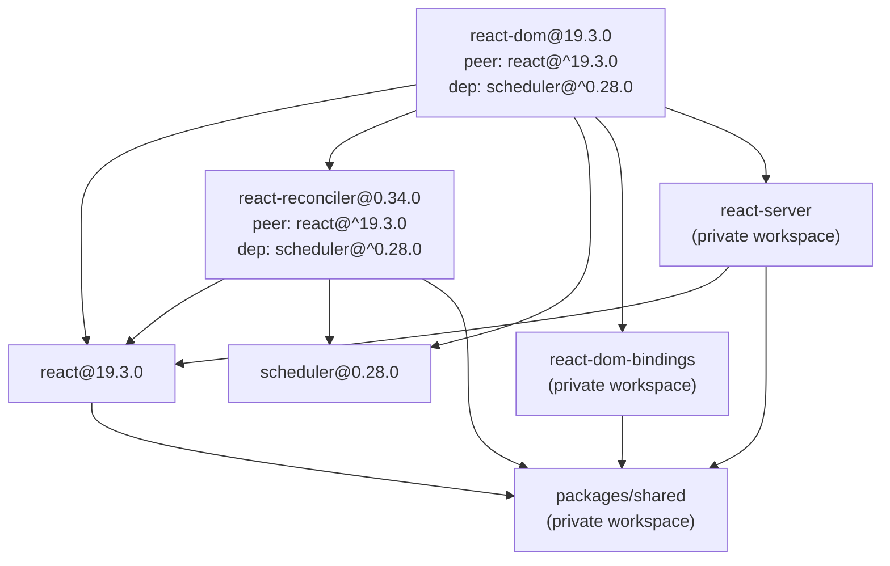
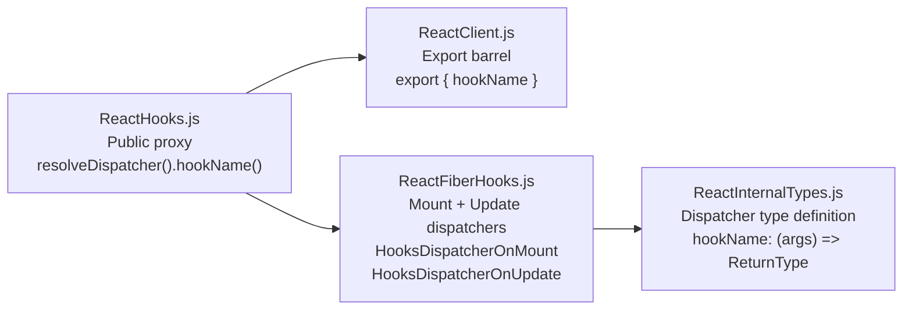

# Technical Specification

# 0. Agent Action Plan

## 0.1 Intent Clarification

### 0.1.1 Core Feature Objective

Based on the prompt, the Blitzy platform understands that the new feature requirement is to **add a new frontend feature to the React monorepo** (facebook/react at version 19.3.0). The user has provided a structured template for frontend feature development that establishes the methodology and constraints for implementing any new user-interface-layer addition to the React library ecosystem.

The core requirements are:

- **Add new UI-layer functionality** to the React monorepo while minimizing disruption to the existing ~38 published packages and their stable APIs
- **Follow the established monorepo conventions** for feature flag gating, build-time fork resolution, entry-point exports, testing infrastructure, and release channel governance
- **Implement using the repository's existing architecture patterns**, including the layered separation between core runtime (`packages/react`), reconciler (`packages/react-reconciler`), renderers (`packages/react-dom`, `packages/react-native-renderer`), shared infrastructure (`packages/shared`), and build tooling (`scripts/rollup/`)
- **Provide comprehensive test coverage** through the Jest-based custom test CLI (`scripts/jest/jest-cli.js`), adhering to the `@gate` pragma feature-flag-gating system and multi-release-channel test matrix (stable, experimental, www-modern, www-classic, xplat)
- **Gate the feature behind the established feature flag system** via `packages/shared/ReactFeatureFlags.js` with appropriate platform-specific forks in `packages/shared/forks/`

Implicit requirements surfaced:

- Any new public API must be exported through the appropriate entry-point barrel files (e.g., `packages/react/src/ReactClient.js`, `packages/react/index.js`, `packages/react/index.experimental.js`)
- New React element types require symbol registration in `packages/shared/ReactSymbols.js`
- New hooks require dispatcher proxy registration in `packages/react/src/ReactHooks.js` and reconciler-level implementation in `packages/react-reconciler/src/ReactFiberHooks.js`
- Build system registration is required in `scripts/rollup/bundles.js` if new entry points are introduced
- Error codes must be maintained via `scripts/error-codes/codes.json` for any new error messages
- The feature must pass all existing CI quality gates: Flow type checking (^0.279.0), Jest tests (^29.4.2 across 130+ parallel jobs), ESLint (^7.7.0 runtime / ^8.57.1 compiler), Prettier (^3.3.3), and bundle size tracking via `dangerfile.js`

### 0.1.2 Special Instructions and Constraints

**Minimal Change Clause**: The user has explicitly mandated a minimal-disruption approach:

- Make only the changes that are absolutely necessary to implement the frontend feature
- Do not modify components that are not directly related to this feature
- Do not refactor existing components unless absolutely required
- Do not change existing component interfaces or props unless specified
- Isolate new code in dedicated files/components when possible
- Use existing design system components wherever possible before creating new ones
- When multiple implementation approaches exist, choose the one that requires the least modification to existing code

**Architectural Requirements** derived from the repository conventions:

- Feature flag gating via `packages/shared/ReactFeatureFlags.js` — new features should start as `__EXPERIMENTAL__` or `false` and be progressively enabled
- Platform-specific fork files in `packages/shared/forks/ReactFeatureFlags.*.js` must be updated in lockstep with the authoritative flag file
- All JavaScript source files must include Flow type annotations (the default parser is `hermes-eslint` ^0.32.0)
- Copyright headers (Meta Platforms, Inc. MIT license) must be present on all new files
- Development-only APIs must be wrapped in `__DEV__` guards and throw in production builds
- Production error messages must use the error code system (`scripts/error-codes/codes.json` + `formatProdErrorMessage`)

**Backward Compatibility Constraints**:

- Stable packages (`react`, `react-dom`) maintain semantic versioning at v19.3.0
- New APIs should not break existing public interfaces
- DevTools backward compatibility must be preserved across React 16.x through 18.2

### 0.1.3 Technical Interpretation

These feature requirements translate to the following technical implementation strategy:

- To **add a new hook**, we will create the hook's public API proxy in `packages/react/src/ReactHooks.js`, export it through `packages/react/src/ReactClient.js` (and server entry if applicable), implement the hook's reconciler logic in `packages/react-reconciler/src/ReactFiberHooks.js`, register the hook type in the `Dispatcher` type definition in `packages/react-reconciler/src/ReactInternalTypes.js`, and gate it behind a feature flag in `packages/shared/ReactFeatureFlags.js`

- To **add a new component type** (like `Activity` or `ViewTransition`), we will register a new symbol in `packages/shared/ReactSymbols.js`, add reconciler handling in `packages/react-reconciler/src/ReactFiberBeginWork.js` and `packages/react-reconciler/src/ReactFiberCompleteWork.js`, export the symbol from `packages/react/src/ReactClient.js`, update `packages/shared/getComponentNameFromType.js` for debugging, and add commit-phase handling in `packages/react-reconciler/src/ReactFiberCommitWork.js` if DOM effects are required

- To **add a new DOM capability**, we will modify the DOM host config in `packages/react-dom-bindings/` for property/event handling, update the Fizz server renderer if SSR support is needed in `packages/react-server/src/ReactFizzServer.js`, and add hydration support in `packages/react-reconciler/src/ReactFiberHydrationContext.js`

- To **ensure build system integration**, we will update `scripts/rollup/bundles.js` for any new entry points, add fork resolution entries in `scripts/rollup/forks.js` if platform-specific behavior is needed, and register new packages in `ReactVersions.js` if a new publishable package is created

- To **validate the feature**, we will create test files in the appropriate `__tests__/` directories adjacent to source, use `@gate` pragmas for feature-flag-conditional test execution, verify across all 6 Jest configuration variants (source, www, xplat, persistent, build, build-devtools), and ensure bundle size impact is tracked through the Danger/sizes-plugin integration

## 0.2 Repository Scope Discovery

### 0.2.1 Comprehensive File Analysis

The React monorepo at version 19.3.0 is organized as a Yarn 1.22.22 workspace (`packages/*`) containing approximately 38 published npm packages. The following analysis maps every category of files that could be affected when adding a new frontend feature, organized by the established repository patterns.

#### Core Runtime API Surface (packages/react/)

These files define React's public API and must be modified to export any new hook, component, or utility:

| File Path | Purpose | Modification Trigger |
|-----------|---------|---------------------|
| `packages/react/src/ReactClient.js` | Primary client-side export barrel — enumerates all public APIs (hooks, components, utilities) | New hook or component type |
| `packages/react/src/ReactServer.js` | Server-side export barrel for `react-server` condition | New API available on server |
| `packages/react/src/ReactServer.experimental.js` | Experimental server exports | New experimental server API |
| `packages/react/src/ReactHooks.js` | Dispatcher proxy layer — each hook calls `resolveDispatcher()` and forwards to reconciler | New hook addition |
| `packages/react/src/ReactStartTransition.js` | Transition API implementation | New transition-related feature |
| `packages/react/src/ReactBaseClasses.js` | `Component` and `PureComponent` constructors | Rare — only if class API changes |
| `packages/react/src/ReactContext.js` | `createContext` implementation | New context-related capability |
| `packages/react/src/ReactCompilerRuntime.js` | Compiler runtime aliases (`useMemoCache` as `c`) | Compiler-specific hook |
| `packages/react/index.js` | Stable entry-point re-export | Any new stable public API |
| `packages/react/index.experimental.js` | Experimental entry-point re-export | Any new experimental API |
| `packages/react/index.development.js` | Development entry-point re-export | Any new development-only API |
| `packages/react/jsx-runtime.js` | JSX runtime bridge | JSX transform changes |
| `packages/react/package.json` | Package manifest with exports map | New entry point or condition |

#### Shared Infrastructure (packages/shared/)

The shared package provides cross-renderer utilities consumed by all packages:

| File Path | Purpose | Modification Trigger |
|-----------|---------|---------------------|
| `packages/shared/ReactFeatureFlags.js` | Authoritative feature flag registry (50+ flags) | Every new feature |
| `packages/shared/ReactSymbols.js` | Symbol registry for React element types (`REACT_*_TYPE`) | New component type |
| `packages/shared/ReactTypes.js` | Flow type catalog shared across packages | New type definitions |
| `packages/shared/ReactElementType.js` | ReactElement Flow shape | Element structure changes |
| `packages/shared/getComponentNameFromType.js` | Debug name resolution for component types | New component type |
| `packages/shared/ReactVersion.js` | Hardcoded version string (19.3.0) | Version bumps only |
| `packages/shared/forks/ReactFeatureFlags.native-oss.js` | Native OSS feature flag fork | New feature flag |
| `packages/shared/forks/ReactFeatureFlags.native-fb.js` | Native FB feature flag fork | New feature flag |
| `packages/shared/forks/ReactFeatureFlags.www.js` | Meta www feature flag fork | New feature flag |
| `packages/shared/forks/ReactFeatureFlags.www-dynamic.js` | Dynamic GK gating fork | New feature flag |
| `packages/shared/forks/ReactFeatureFlags.test-renderer.js` | Test renderer flag fork | New feature flag |
| `packages/shared/forks/ReactFeatureFlags.readonly.js` | Build artifact readonly flags | New feature flag |

#### Reconciler Engine (packages/react-reconciler/src/)

The fiber reconciler contains 80+ source files implementing React's core diffing and scheduling:

| File Path | Purpose | Modification Trigger |
|-----------|---------|---------------------|
| `packages/react-reconciler/src/ReactFiberHooks.js` | Complete hook implementation (mount/update dispatchers) | New hook |
| `packages/react-reconciler/src/ReactFiberBeginWork.js` | Top-down render traversal — type dispatch for fiber processing | New component type |
| `packages/react-reconciler/src/ReactFiberCompleteWork.js` | Bottom-up output construction — host node creation | New component type |
| `packages/react-reconciler/src/ReactFiberCommitWork.js` | DOM commit phase — mutation, layout, passive effects | New effect or DOM behavior |
| `packages/react-reconciler/src/ReactInternalTypes.js` | `Dispatcher` type, `Fiber` type, `MemoCache` type | New hook or fiber field |
| `packages/react-reconciler/src/ReactFiberWorkLoop.js` | Incremental work loop — `performWorkOnRoot`, yielding | Scheduling changes |
| `packages/react-reconciler/src/ReactFiberLane.js` | Lane-based priority bitmask system (31-bit) | New priority lane |
| `packages/react-reconciler/src/ReactFiber.js` | Fiber node construction | New fiber type |
| `packages/react-reconciler/src/ReactFiberFlags.js` | Effect flags bitmask definitions | New effect type |
| `packages/react-reconciler/src/ReactHookEffectTags.js` | Hook effect tag constants | New effect tag |
| `packages/react-reconciler/src/ReactFiberHydrationContext.js` | Server hydration logic | SSR-compatible feature |
| `packages/react-reconciler/src/ReactFiberReconciler.js` | Public reconciler API | New reconciler export |
| `packages/react-reconciler/src/ReactFiberDevToolsHook.js` | DevTools integration hooks | DevTools-visible feature |

#### DOM Renderer (packages/react-dom/)

| File Path | Purpose | Modification Trigger |
|-----------|---------|---------------------|
| `packages/react-dom/src/client/ReactDOMRoot.js` | `createRoot`, `hydrateRoot` implementation | Root-level behavior change |
| `packages/react-dom/src/shared/ReactDOM.js` | Public DOM helpers aggregation | New DOM utility |
| `packages/react-dom/src/shared/ReactDOMFloat.js` | Resource hint helpers (`preload`, `preinit`) | New resource hint |
| `packages/react-dom/src/shared/ReactDOMFlushSync.js` | `flushSync` implementation | Sync flushing changes |
| `packages/react-dom/client.js` | Client entry-point facade | New client API |
| `packages/react-dom/index.js` | Package entry-point barrel | New public API |
| `packages/react-dom/package.json` | Manifest with exports map and peer deps | New entry point |

#### DOM Bindings (packages/react-dom-bindings/)

| File Path Pattern | Purpose | Modification Trigger |
|-------------------|---------|---------------------|
| `packages/react-dom-bindings/src/client/ReactDOMComponent.js` | DOM property/attribute handling | New DOM prop |
| `packages/react-dom-bindings/src/client/ReactFiberConfigDOM.js` | DOM host config for reconciler | New host element type |
| `packages/react-dom-bindings/src/events/**/*.js` | Synthetic event system and plugins | New event handling |
| `packages/react-dom-bindings/src/server/ReactFizzConfigDOM.js` | Fizz server DOM configuration | SSR for new element |

#### Server Rendering (packages/react-server/)

| File Path | Purpose | Modification Trigger |
|-----------|---------|---------------------|
| `packages/react-server/src/ReactFizzServer.js` | Fizz SSR engine — streaming task lifecycle | SSR-compatible feature |
| `packages/react-server/src/ReactFizzHooks.js` | Server-side hook dispatcher | Server-rendered hook |
| `packages/react-server/src/ReactFlightServer.js` | Flight RSC serialization engine | RSC-compatible feature |
| `packages/react-server/src/ReactFlightHooks.js` | Server component hook semantics | Server component hook |

#### Build System (scripts/)

| File Path | Purpose | Modification Trigger |
|-----------|---------|---------------------|
| `scripts/rollup/bundles.js` | Bundle definition registry for all packages | New entry point or package |
| `scripts/rollup/forks.js` | Platform-specific fork resolution logic | New platform fork |
| `scripts/rollup/modules.js` | External modules and peer globals | New external dependency |
| `scripts/shared/inlinedHostConfigs.js` | Host config metadata for build and test | New renderer config |
| `scripts/error-codes/codes.json` | Append-only production error code registry | New error messages |
| `scripts/error-codes/extract-errors.js` | Error code extraction from source | Automatic during build |
| `scripts/jest/TestFlags.js` | Feature flag gating for test execution | New testable feature flag |

#### CI/CD Workflows (.github/workflows/)

| File Path | Purpose | Modification Trigger |
|-----------|---------|---------------------|
| `.github/workflows/runtime_build_and_test.yml` | Main runtime CI (90 source + 40 build shards) | Typically unchanged |
| `.github/workflows/runtime_fuzz_tests.yml` | Hourly fuzz testing | Typically unchanged |
| `.github/workflows/shared_lint.yml` | Lint/format/license checks | Typically unchanged |

#### Test Files (**/__tests__/)

| File Path Pattern | Purpose | Modification Trigger |
|-------------------|---------|---------------------|
| `packages/react/src/__tests__/*-test.js` | Core React API tests | New hook or component |
| `packages/react-dom/src/__tests__/*-test.js` | DOM renderer tests | New DOM behavior |
| `packages/react-reconciler/src/__tests__/*-test.js` | Reconciler internals tests | Reconciler changes |
| `packages/react-server/src/__tests__/*-test.js` | Server rendering tests | SSR feature |

#### Configuration Files

| File Path | Purpose | Modification Trigger |
|-----------|---------|---------------------|
| `ReactVersions.js` | Version matrix for all packages | New publishable package |
| `package.json` | Root monorepo manifest (workspaces, scripts) | New workspace or dependency |
| `.eslintrc.js` | ESLint configuration with custom rules | New global variable |
| `.prettierrc.js` | Prettier configuration | Typically unchanged |
| `babel.config.js` | Babel transform configuration | New transform requirement |

### 0.2.2 Web Search Research Conducted

The documentation URL provided by the user (`https://docs.blitzy.com/llms.txt`) was attempted but is not accessible. Research conclusions are therefore drawn from the repository's own documentation and established patterns:

- **Feature addition pattern**: Examined existing recent features (`enableViewTransition`, `enableGestureTransition`, `enableOptimisticKey`) in `ReactFeatureFlags.js` to understand the flag lifecycle
- **Hook addition pattern**: Traced the implementation of `useOptimistic` and `useActionState` through `ReactHooks.js` → `ReactClient.js` → `ReactFiberHooks.js` to map the complete hook integration path
- **Component type addition pattern**: Traced `REACT_VIEW_TRANSITION_TYPE` and `REACT_ACTIVITY_TYPE` through `ReactSymbols.js` → `ReactClient.js` → `ReactFiberBeginWork.js` → `ReactFiberCompleteWork.js`
- **Testing patterns**: Verified the `@gate` pragma system via `scripts/jest/TestFlags.js` and Babel plugin `transform-test-gate-pragma`

### 0.2.3 New File Requirements

When adding a new frontend feature to the React monorepo, the following new files are typically required (using `[feature]` as a placeholder for the specific feature name):

**New source files to create:**

- `packages/react/src/React[Feature].js` — Public API implementation for the new feature (follows pattern of `ReactStartTransition.js`, `ReactCacheClient.js`)
- `packages/react-reconciler/src/ReactFiber[Feature].js` — Reconciler-level implementation if the feature requires fiber-level scheduling or state management (follows pattern of `ReactFiberGestureScheduler.js`, `ReactFiberViewTransitionComponent.js`)
- `packages/react-dom-bindings/src/client/ReactDOM[Feature].js` — DOM-specific bindings if the feature introduces new DOM behavior (follows pattern of `ReactDOMViewTransition.js`)

**New test files to create:**

- `packages/react/src/__tests__/React[Feature]-test.js` — Unit tests for the public API
- `packages/react-dom/src/__tests__/React[Feature]-test.js` — DOM integration tests
- `packages/react-reconciler/src/__tests__/ReactFiber[Feature]-test.internal.js` — Reconciler internal tests (gated with `@gate` pragmas)

**New configuration (if applicable):**

- Entry in `packages/shared/ReactFeatureFlags.js` — Feature flag (e.g., `export const enable[Feature]: boolean = __EXPERIMENTAL__;`)
- Corresponding entries in each fork file: `packages/shared/forks/ReactFeatureFlags.*.js`

## 0.3 Dependency Inventory

### 0.3.1 Key Packages

The React monorepo operates as a **zero-runtime-dependency library**: the published packages (`react`, `react-dom`, etc.) have no direct npm dependencies except for peer dependencies between sibling packages. All tooling is held as `devDependencies` in the root `package.json`. The following table lists the key packages relevant to any frontend feature addition:

| Registry | Package Name | Version | Purpose |
|----------|-------------|---------|---------|
| npm (workspace) | `react` | 19.3.0 | Core component model, hooks API, JSX runtimes |
| npm (workspace) | `react-dom` | 19.3.0 | DOM rendering surface (client, server, static) |
| npm (workspace) | `react-reconciler` | 0.34.0 | Fiber-based reconciliation engine |
| npm (workspace) | `scheduler` | 0.28.0 | Cooperative priority scheduling |
| npm (workspace) | `packages/shared` | 19.3.0 | Feature flags, types, symbols (private, not published) |
| npm (workspace) | `react-server` | 19.3.0 | Fizz SSR and Flight RSC engines |
| npm (workspace) | `react-dom-bindings` | 19.3.0 | DOM host config and event system (private) |
| npm (workspace) | `react-refresh` | 0.19.0 | Fast Refresh HMR runtime |
| npm (workspace) | `react-is` | 19.3.0 | React type-checking utilities |
| npm (workspace) | `internal-test-utils` | N/A | Shared test helpers (private, not published) |
| npm (workspace) | `eslint-plugin-react-hooks` | 7.1.0 | ESLint rules for hooks |
| npm (devDep) | `@babel/core` | ^7.11.1 | Babel transpilation engine |
| npm (devDep) | `@babel/preset-flow` | ^7.10.4 | Flow type annotation stripping |
| npm (devDep) | `@babel/preset-react` | ^7.23.3 | JSX transform |
| npm (devDep) | `rollup` | ^3.29.5 | Runtime package bundler |
| npm (devDep) | `google-closure-compiler` | ^20230206.0.0 | Advanced minification |
| npm (devDep) | `jest` | ^29.4.2 | Test framework |
| npm (devDep) | `jest-environment-jsdom` | ^29.4.2 | DOM environment simulation |
| npm (devDep) | `flow-bin` | ^0.279.0 | Flow type checker |
| npm (devDep) | `typescript` | ^5.4.3 | TypeScript compiler (compiler workspace) |
| npm (devDep) | `eslint` | ^7.7.0 | Linting (runtime workspace) |
| npm (devDep) | `prettier` | ^3.3.3 | Code formatting |
| npm (devDep) | `hermes-eslint` | ^0.32.0 | ESLint parser for Flow/Hermes syntax |
| npm (devDep) | `hermes-parser` | ^0.32.0 | AST parser |
| npm (devDep) | `danger` | ^11.2.3 | CI code review / bundle size automation |

### 0.3.2 Inter-Package Dependency Graph

The following peer dependency relationships govern how the workspace packages interconnect:

### 0.3.3 Dependency Updates

For a typical new frontend feature addition, **no new external dependencies are required**. The React monorepo deliberately maintains zero runtime dependencies — the published `react` package has no `dependencies` field. All tooling dependencies are already installed.

**Import Updates**: When adding a new feature, the following import patterns must be followed:

- Internal cross-package imports use bare specifiers resolved by the build system: `import X from 'shared/ReactFeatureFlags'` (not relative paths)
- New exports must be added to the appropriate barrel files following the existing enumeration pattern (explicit named exports, no `export *`)
- Feature flag imports follow: `import { enableFeatureName } from 'shared/ReactFeatureFlags'`
- Symbol imports follow: `import { REACT_FEATURE_TYPE } from 'shared/ReactSymbols'`

**External Reference Updates**: The following files require updates when adding new features:

- `scripts/error-codes/codes.json` — Append new error codes (never modify existing entries)
- `packages/shared/forks/ReactFeatureFlags.*.js` — All 10 fork files must be updated in lockstep
- `scripts/jest/TestFlags.js` — If the feature flag needs special test aliasing
- `scripts/rollup/bundles.js` — If new entry points are introduced
- `scripts/rollup/forks.js` — If platform-specific fork resolution is needed

## 0.4 Integration Analysis

### 0.4.1 Existing Code Touchpoints

The React monorepo's layered architecture creates well-defined integration points that any new frontend feature must navigate. The following analysis documents every touchpoint category, organized by the data flow from public API surface to internal implementation.

#### Direct Modifications Required

**Public API Registration** (`packages/react/`):

- `packages/react/src/ReactClient.js` — Add the new feature's export to the client-side barrel. This file explicitly enumerates every public symbol (hooks, components, utilities, types). The export must follow the existing pattern of explicit named exports
- `packages/react/src/ReactServer.js` — If the feature is available in server components, add the export here as well. Server exports are a subset of client exports (no hooks that require state, no DOM-specific APIs)
- `packages/react/index.js` — Add re-export for stable features
- `packages/react/index.experimental.js` — Add re-export for experimental features gated behind `__EXPERIMENTAL__`

**Feature Flag Registration** (`packages/shared/`):

- `packages/shared/ReactFeatureFlags.js` — Add the flag under the appropriate category section:
  - `__EXPERIMENTAL__` for new features in active development
  - `false` for features not yet ready for any channel
  - `true` for features that are fully shipped
- All 10 platform fork files must receive the corresponding flag entry:
  - `packages/shared/forks/ReactFeatureFlags.native-oss.js`
  - `packages/shared/forks/ReactFeatureFlags.native-fb.js`
  - `packages/shared/forks/ReactFeatureFlags.native-fb-dynamic.js`
  - `packages/shared/forks/ReactFeatureFlags.www.js`
  - `packages/shared/forks/ReactFeatureFlags.www-dynamic.js`
  - `packages/shared/forks/ReactFeatureFlags.test-renderer.js`
  - `packages/shared/forks/ReactFeatureFlags.test-renderer.native-fb.js`
  - `packages/shared/forks/ReactFeatureFlags.test-renderer.www.js`
  - `packages/shared/forks/ReactFeatureFlags.readonly.js`

**Symbol Registration** (for new component types):

- `packages/shared/ReactSymbols.js` — Register `export const REACT_[FEATURE]_TYPE: symbol = Symbol.for('react.[feature]');`
- `packages/shared/getComponentNameFromType.js` — Add case for new symbol to return human-readable name for dev warnings and DevTools

#### Hook Implementation Chain

For new hooks, the implementation chain follows a strict four-layer delegation pattern:

- `packages/react/src/ReactHooks.js` — Add the public proxy function that calls `resolveDispatcher()` and forwards arguments
- `packages/react-reconciler/src/ReactInternalTypes.js` — Add the hook to the `Dispatcher` Flow type interface
- `packages/react-reconciler/src/ReactFiberHooks.js` — Implement `mountHookName()` and `updateHookName()` functions, then register them in `HooksDispatcherOnMount`, `HooksDispatcherOnUpdate`, `HooksDispatcherOnRerender`, and all other dispatcher variants (Invalid, MountWithHookTypes)

#### Component Type Processing Chain

For new component types, the reconciler processes them through a begin-work → complete-work → commit cycle:

- `packages/react-reconciler/src/ReactFiberBeginWork.js` — Add `case` in the `beginWork` function's switch statement to handle the new fiber tag
- `packages/react-reconciler/src/ReactFiberCompleteWork.js` — Add corresponding `case` for output construction
- `packages/react-reconciler/src/ReactFiberCommitWork.js` — Add mutation/layout/passive effect handling if the component produces DOM effects
- `packages/react-reconciler/src/ReactFiber.js` — Add new `WorkTag` constant and fiber creation function
- `packages/react-reconciler/src/ReactWorkTags.js` — Register the new `WorkTag` numeric constant

#### Server Rendering Integration

If the feature must support SSR:

- `packages/react-server/src/ReactFizzServer.js` — Add rendering logic in the Fizz work loop for the new element type
- `packages/react-server/src/ReactFizzHooks.js` — Add server-side hook implementation if the feature is a hook
- `packages/react-dom-bindings/src/server/ReactFizzConfigDOM.js` — Add DOM-specific Fizz configuration
- `packages/react-reconciler/src/ReactFiberHydrationContext.js` — Add hydration logic for matching server-rendered output

#### DevTools Integration

- `packages/react-devtools-shared/src/backend/ReactSymbols.js` — Mirror any new symbols added to `packages/shared/ReactSymbols.js`
- `packages/react-reconciler/src/ReactFiberDevToolsHook.js` — Ensure new fiber types are reported to the DevTools bridge

### 0.4.2 Build System Integration Points

The Rollup-based build system requires awareness of any new entry points or fork requirements:

- `scripts/rollup/bundles.js` — Contains the bundle definition array. Each bundle specifies `bundleTypes`, `moduleType`, `entry`, `global`, `minifyWithProdErrorCodes`, `wrapWithModuleBoundaries`, and optional `condition` fields. New entry points must be registered here
- `scripts/rollup/forks.js` — The fork resolution map. If the new feature requires different behavior across platforms (DOM vs Native vs ART), add a fork entry that maps the shared module path to platform-specific implementations
- `scripts/rollup/modules.js` — External module declarations and peer global mappings. Only relevant if the feature introduces a new peer dependency (extremely rare for React)
- `scripts/shared/inlinedHostConfigs.js` — Host config metadata array. Each entry defines `shortName`, `entryPoints[]`, and `paths[]` for a renderer variant. If the feature adds new entry points to an existing renderer, they must be registered here

### 0.4.3 Error Code Integration

Every new `Error()` construction in React source must use the production error code system:

- `scripts/error-codes/codes.json` — Append-only JSON map of numeric codes to error message templates. The `extract-errors.js` build script scans source for `new Error()` calls and assigns codes
- `scripts/error-codes/transform-error-messages.js` — Babel plugin that replaces literal error messages with `formatProdErrorMessage(code)` calls in production builds
- This ensures production bundles remain small while dev builds retain readable error messages

## 0.5 Technical Implementation

### 0.5.1 File-by-File Execution Plan

Every file listed below must be created or modified. Files are organized into execution groups that reflect the natural dependency order within the React monorepo architecture.

**Group 1 — Feature Flag and Shared Infrastructure (Foundation Layer)**

| Action | File Path | Purpose |
|--------|-----------|---------|
| MODIFY | `packages/shared/ReactFeatureFlags.js` | Add `export const enable[Feature]: boolean = __EXPERIMENTAL__;` under the "Ongoing experiments" section |
| MODIFY | `packages/shared/forks/ReactFeatureFlags.native-oss.js` | Add `enable[Feature]` flag with appropriate default (`false` for conservative rollout) |
| MODIFY | `packages/shared/forks/ReactFeatureFlags.native-fb.js` | Add `enable[Feature]` flag |
| MODIFY | `packages/shared/forks/ReactFeatureFlags.native-fb-dynamic.js` | Add `enable[Feature]` flag with dynamic GK gate |
| MODIFY | `packages/shared/forks/ReactFeatureFlags.www.js` | Add `enable[Feature]` flag |
| MODIFY | `packages/shared/forks/ReactFeatureFlags.www-dynamic.js` | Add `enable[Feature]` flag with dynamic GK gate |
| MODIFY | `packages/shared/forks/ReactFeatureFlags.test-renderer.js` | Add `enable[Feature]` flag |
| MODIFY | `packages/shared/forks/ReactFeatureFlags.test-renderer.native-fb.js` | Add `enable[Feature]` flag |
| MODIFY | `packages/shared/forks/ReactFeatureFlags.test-renderer.www.js` | Add `enable[Feature]` flag |
| MODIFY | `packages/shared/forks/ReactFeatureFlags.readonly.js` | Add `enable[Feature]` flag matching build config |
| MODIFY | `packages/shared/ReactSymbols.js` | Register new symbol (if component type): `export const REACT_[FEATURE]_TYPE: symbol = Symbol.for('react.[feature]');` |
| MODIFY | `packages/shared/getComponentNameFromType.js` | Add case to resolve new symbol to display name string |
| MODIFY | `packages/shared/ReactTypes.js` | Add new Flow type definitions if the feature introduces shared types |

**Group 2 — Core React API (Public Surface)**

| Action | File Path | Purpose |
|--------|-----------|---------|
| CREATE | `packages/react/src/React[Feature].js` | Implement the feature's public API logic (hook proxy, utility, or component factory) |
| MODIFY | `packages/react/src/ReactHooks.js` | Add hook proxy function (if hook): call `resolveDispatcher()` and forward args |
| MODIFY | `packages/react/src/ReactClient.js` | Import and re-export the new feature in the client barrel |
| MODIFY | `packages/react/src/ReactServer.js` | Export for server builds (if applicable) |
| MODIFY | `packages/react/index.js` | Re-export for stable entry point (when feature graduates from experimental) |
| MODIFY | `packages/react/index.experimental.js` | Re-export for experimental entry point |
| MODIFY | `packages/react/index.experimental.development.js` | Re-export for dev experimental builds |

**Group 3 — Reconciler Implementation (Core Engine)**

| Action | File Path | Purpose |
|--------|-----------|---------|
| MODIFY | `packages/react-reconciler/src/ReactInternalTypes.js` | Add hook to `Dispatcher` type or new fiber field types |
| MODIFY | `packages/react-reconciler/src/ReactFiberHooks.js` | Implement `mount[Feature]()` and `update[Feature]()` hook functions; register in all dispatcher tables |
| MODIFY | `packages/react-reconciler/src/ReactFiberBeginWork.js` | Add `case` for new component type (if applicable) |
| MODIFY | `packages/react-reconciler/src/ReactFiberCompleteWork.js` | Add `case` for output construction (if applicable) |
| MODIFY | `packages/react-reconciler/src/ReactFiberCommitWork.js` | Add mutation/layout/passive effect handling (if applicable) |
| CREATE | `packages/react-reconciler/src/ReactFiber[Feature].js` | Dedicated module for complex feature logic (if needed) |
| MODIFY | `packages/react-reconciler/src/ReactWorkTags.js` | Add new `WorkTag` constant (if new component type) |
| MODIFY | `packages/react-reconciler/src/ReactFiber.js` | Add fiber creation function for new type (if applicable) |

**Group 4 — DOM Renderer Integration (Platform Layer)**

| Action | File Path | Purpose |
|--------|-----------|---------|
| MODIFY | `packages/react-dom-bindings/src/client/ReactFiberConfigDOM.js` | Add DOM host config methods for new behavior |
| MODIFY | `packages/react-dom-bindings/src/client/ReactDOMComponent.js` | Handle new DOM properties/attributes (if applicable) |
| CREATE | `packages/react-dom-bindings/src/client/ReactDOM[Feature].js` | DOM-specific feature implementation (if needed) |
| MODIFY | `packages/react-dom/src/shared/ReactDOM.js` | Export new DOM utility (if public DOM API) |
| MODIFY | `packages/react-dom/client.js` | Update client facade (if new client API) |

**Group 5 — Server Rendering Integration (if SSR-compatible)**

| Action | File Path | Purpose |
|--------|-----------|---------|
| MODIFY | `packages/react-server/src/ReactFizzServer.js` | Add Fizz rendering logic for new element type |
| MODIFY | `packages/react-server/src/ReactFizzHooks.js` | Add server hook dispatcher entry |
| MODIFY | `packages/react-dom-bindings/src/server/ReactFizzConfigDOM.js` | DOM Fizz configuration for new element |
| MODIFY | `packages/react-reconciler/src/ReactFiberHydrationContext.js` | Hydration matching for server-rendered content |

**Group 6 — Tests and Quality Assurance**

| Action | File Path | Purpose |
|--------|-----------|---------|
| CREATE | `packages/react/src/__tests__/React[Feature]-test.js` | Public API unit tests |
| CREATE | `packages/react-dom/src/__tests__/React[Feature]-test.js` | DOM integration tests |
| CREATE | `packages/react-reconciler/src/__tests__/ReactFiber[Feature]-test.internal.js` | Reconciler internals tests |
| MODIFY | `scripts/error-codes/codes.json` | Append error codes for new error messages |
| MODIFY | `packages/react-devtools-shared/src/backend/ReactSymbols.js` | Mirror new symbols for DevTools |

### 0.5.2 Implementation Approach per File

The implementation follows a strict bottom-up dependency order:

- **Establish foundation** by adding feature flags in `packages/shared/ReactFeatureFlags.js` and all fork files — this enables `@gate` pragma-based conditional test execution immediately
- **Register shared types and symbols** in `packages/shared/ReactSymbols.js`, `packages/shared/ReactTypes.js`, and `packages/shared/getComponentNameFromType.js` — providing the type-system foundation
- **Implement the public API** in `packages/react/src/React[Feature].js` and wire it through `ReactHooks.js` (for hooks) or directly through `ReactClient.js` — establishing the developer-facing surface
- **Build the reconciler implementation** in `packages/react-reconciler/src/ReactFiberHooks.js` (for hooks) or the begin/complete/commit work files (for component types) — this is the core algorithmic work
- **Integrate with the DOM renderer** via `packages/react-dom-bindings/` — connecting the reconciler's abstract operations to concrete DOM mutations
- **Add server rendering support** (if needed) via `packages/react-server/src/` — ensuring Fizz streaming and Flight serialization handle the new feature
- **Write comprehensive tests** gated with `@gate enable[Feature]` pragmas — leveraging the feature flag system for conditional test execution across release channels
- **Update error codes** via `scripts/error-codes/codes.json` — ensuring production error messages are properly encoded

### 0.5.3 User Interface Design Considerations

Since the React monorepo is a **library** rather than an end-user application, "user interface" in this context refers to the **developer-facing API surface** that downstream applications consume. Key design considerations include:

- **API Ergonomics**: New hooks should follow the established naming convention (`use[Feature]`), accept the minimum required arguments, and return values consistent with existing hooks
- **Progressive Disclosure**: Features should start behind `__EXPERIMENTAL__` flags and graduate to stable as they prove reliable, following the three-channel release model (`@latest`, `@canary`, `@experimental`)
- **Error Messaging**: Development builds must provide clear, actionable error messages. Production builds use the error code system for minimal bundle size
- **DevTools Visibility**: New component types and hooks should be visible and inspectable in React DevTools, which requires symbol registration and proper fiber type reporting
- **SSR Compatibility**: Features that render output must support both client-side rendering and server-side streaming (Fizz), with proper hydration matching to avoid mismatches

## 0.6 Scope Boundaries

### 0.6.1 Exhaustively In Scope

The following files and directories are in scope for a new frontend feature addition, using trailing wildcards where patterns apply:

**Feature Source Files:**
- `packages/react/src/React[Feature]*.js` — All feature-specific source modules
- `packages/react/src/ReactClient.js` — Client barrel export registration
- `packages/react/src/ReactServer*.js` — Server barrel export registration (if applicable)
- `packages/react/src/ReactHooks.js` — Hook proxy registration (for hooks)
- `packages/react/index*.js` — Entry-point re-exports (stable, experimental, development)

**Shared Infrastructure:**
- `packages/shared/ReactFeatureFlags.js` — Authoritative feature flag
- `packages/shared/forks/ReactFeatureFlags.*.js` — All 10 platform-specific fork files
- `packages/shared/ReactSymbols.js` — New element type symbols
- `packages/shared/ReactTypes.js` — Shared Flow type definitions
- `packages/shared/getComponentNameFromType.js` — Debug name resolution

**Reconciler Files:**
- `packages/react-reconciler/src/ReactFiberHooks.js` — Hook mount/update implementation
- `packages/react-reconciler/src/ReactFiberBeginWork.js` — Begin-work type dispatch
- `packages/react-reconciler/src/ReactFiberCompleteWork.js` — Complete-work output construction
- `packages/react-reconciler/src/ReactFiberCommitWork.js` — Commit-phase effect processing
- `packages/react-reconciler/src/ReactInternalTypes.js` — Dispatcher and fiber type definitions
- `packages/react-reconciler/src/ReactWorkTags.js` — Work tag constants
- `packages/react-reconciler/src/ReactFiber.js` — Fiber node construction
- `packages/react-reconciler/src/ReactFiber[Feature]*.js` — Feature-specific reconciler modules

**DOM Renderer:**
- `packages/react-dom-bindings/src/client/ReactFiberConfigDOM.js` — DOM host config
- `packages/react-dom-bindings/src/client/ReactDOMComponent.js` — DOM property handling
- `packages/react-dom-bindings/src/client/ReactDOM[Feature]*.js` — Feature-specific DOM modules
- `packages/react-dom-bindings/src/server/ReactFizzConfigDOM.js` — Fizz DOM config
- `packages/react-dom/src/shared/ReactDOM.js` — Public DOM helpers
- `packages/react-dom/client.js` — Client entry facade
- `packages/react-dom/index.js` — Package entry barrel

**Server Rendering (if SSR-compatible):**
- `packages/react-server/src/ReactFizzServer.js` — Fizz SSR engine
- `packages/react-server/src/ReactFizzHooks.js` — Server hook dispatcher
- `packages/react-server/src/ReactFlightServer.js` — Flight RSC engine
- `packages/react-reconciler/src/ReactFiberHydrationContext.js` — Hydration logic

**Test Files:**
- `packages/react/src/__tests__/React[Feature]*-test.js` — Core API tests
- `packages/react-dom/src/__tests__/React[Feature]*-test.js` — DOM integration tests
- `packages/react-reconciler/src/__tests__/ReactFiber[Feature]*-test*.js` — Reconciler tests
- `packages/react-server/src/__tests__/React[Feature]*-test.js` — Server tests

**Build and Error Codes:**
- `scripts/error-codes/codes.json` — New error code entries
- `scripts/rollup/bundles.js` — Bundle registration (if new entry points)
- `scripts/rollup/forks.js` — Fork resolution (if platform-specific)
- `scripts/shared/inlinedHostConfigs.js` — Host config metadata (if new renderer entries)

**DevTools Integration:**
- `packages/react-devtools-shared/src/backend/ReactSymbols.js` — Symbol mirroring

**Configuration:**
- `packages/react/package.json` — Exports map (if new entry condition)
- `packages/react-dom/package.json` — Exports map (if new server variant)

### 0.6.2 Explicitly Out of Scope

The following are explicitly **not in scope** for this frontend feature addition, per the minimal change clause:

- **Compiler workspace** (`compiler/**/*`) — The React Compiler operates as an independent build-time optimization layer. Compiler changes are only needed if the new feature introduces a hook or pattern that requires special compiler handling (e.g., a new `useMemoCache` variant)
- **DevTools UI packages** (`packages/react-devtools`, `packages/react-devtools-extensions`, `packages/react-devtools-inline`, `packages/react-devtools-timeline`, `packages/react-devtools-shell`, `packages/react-devtools-fusebox`, `packages/react-devtools-core`) — DevTools frontend changes are a separate concern from library feature development
- **Fixture applications** (`fixtures/**/*`) — While fixtures can be used for manual testing, they are not part of the feature implementation
- **CI/CD workflows** (`.github/workflows/**/*.yml`) — The existing 24 workflows already cover the test matrix; no changes are needed for a standard feature addition
- **Release automation** (`scripts/release/**/*`, `scripts/devtools/**/*`) — Release scripts are only modified during release operations
- **React Native renderer internals** (`packages/react-native-renderer/src/**/*`) — Native renderer changes require separate coordination with the `react-native` repository
- **Unrelated packages** (`packages/react-art/**/*`, `packages/use-subscription/**/*`, `packages/use-sync-external-store/**/*`, `packages/react-cache/**/*`) — Only touch packages directly affected by the feature
- **Performance optimizations** beyond feature requirements — Do not optimize existing code paths unless directly required for the new feature
- **Refactoring of existing code** unrelated to integration — Per the minimal change clause, avoid modifying existing component interfaces or props
- **Version bumps** — `ReactVersions.js` version changes are handled separately during release cycles
- **Root configuration files** (`.eslintrc.js`, `.prettierrc.js`, `.editorconfig`, `babel.config.js`) — These are global configurations that should not change for individual features

## 0.7 Rules for Feature Addition

### 0.7.1 Minimal Change Discipline

The user has explicitly mandated the following rules for all feature additions. These are non-negotiable constraints that must be adhered to throughout implementation:

- **Make only the changes that are absolutely necessary** to implement the frontend feature. Do not refactor, optimize, or modify existing code unless it is directly required for the new feature to work
- **Do not modify components or modules that are not directly related** to this feature. If an existing module needs a minor interface extension, prefer additive changes over modifications
- **Do not change existing component interfaces or props** unless explicitly specified in the feature requirements
- **Isolate new code in dedicated files/components** when possible. The React monorepo pattern of creating dedicated modules (e.g., `ReactFiberGestureScheduler.js`, `ReactFiberViewTransitionComponent.js`) should be followed
- **Use existing infrastructure wherever possible** before creating new patterns. The repository already provides comprehensive tooling for feature flags, type systems, error codes, and testing
- **When multiple implementation approaches exist**, choose the one that requires the least modification to existing code

### 0.7.2 Repository Convention Rules

The following rules are derived from the React monorepo's established patterns and must be followed:

- **Feature Flag Gating**: Every new feature must be gated behind a flag in `packages/shared/ReactFeatureFlags.js`. The flag should start as `__EXPERIMENTAL__` (enabled only in experimental channel) or `false` (disabled everywhere), never as `true` unless the feature is fully shipped
- **Flag Fork Synchronization**: All 10 platform-specific fork files in `packages/shared/forks/` must be updated whenever the authoritative flag file changes. Missing a fork file will cause build failures in platform-specific builds
- **Flow Type Annotations**: All JavaScript source files in the runtime workspace must include Flow type annotations. The file header must include `@flow` pragma. The Hermes parser (`hermes-eslint` ^0.32.0) is used for parsing
- **Copyright Headers**: Every new file must include the standard Meta Platforms copyright header with MIT license reference
- **Production Error Codes**: Never use inline error message strings in production code paths. Register error codes in `scripts/error-codes/codes.json` and use `formatProdErrorMessage(code)` in production builds
- **DEV Guards**: Development-only code paths (warnings, validation, stack traces) must be wrapped in `if (__DEV__)` blocks. These are stripped from production builds by the Rollup replace plugin
- **Explicit Exports**: Never use `export *` in barrel files. All exports must be explicitly enumerated following the pattern in `ReactClient.js`
- **Test File Naming**: Test files follow the pattern `[ModuleName]-test.js` for public tests and `[ModuleName]-test.internal.js` for internal-only tests. They reside in `__tests__/` directories adjacent to source
- **Gate Pragmas**: Test files that exercise feature-flag-gated behavior must use `// @gate enable[Feature]` pragma annotations for conditional execution
- **No Watch Mode**: Tests must be run through `scripts/jest/jest-cli.js` with appropriate flags, never via direct Jest invocation

### 0.7.3 Integration Requirements

- **Backward Compatibility**: New APIs must not break existing public interfaces within the same major version (currently v19.x). Additive changes only
- **DevTools Awareness**: New component types registered in `ReactSymbols.js` must be mirrored in `react-devtools-shared/src/backend/ReactSymbols.js` so DevTools can display them
- **SSR Considerations**: Features that produce renderable output should support both client-side rendering and Fizz streaming SSR. If SSR support is deferred, this must be explicitly documented
- **Hydration Safety**: Features that produce DOM output in SSR must implement hydration matching in `ReactFiberHydrationContext.js` to prevent hydration mismatches

### 0.7.4 Quality Gate Requirements

Before a feature can be considered complete, it must pass all existing CI quality gates:

- **Flow type checking** across the host config matrix (runtime workspace)
- **Jest tests** across 6 configuration variants (130+ parallel CI jobs)
- **ESLint** linting with custom rules (`no-production-logging`, `prod-error-codes`)
- **Prettier** formatting with Flow parser default
- **Bundle size tracking** — bundle size deltas are reported on PRs via `dangerfile.js` and must not introduce unexplained size regressions
- **Error code extraction** — `scripts/error-codes/extract-errors.js` must successfully process all new error messages

## 0.8 References

### 0.8.1 Repository Files and Folders Searched

The following files and folders were systematically explored to derive the conclusions documented in this Agent Action Plan:

**Root-Level Configuration Files:**
- `package.json` — Root monorepo manifest (workspace definitions, devDependencies, scripts, resolutions, packageManager)
- `ReactVersions.js` — Version matrix for all packages (v19.3.0 stable, release channel configurations)
- `.nvmrc` — Node.js version specification (v20.19.0)
- `.eslintrc.js` — ESLint configuration (hermes-eslint parser, custom rules, Flow/React plugins)
- `.prettierrc.js` — Prettier configuration (Flow parser default, 80 columns, single quotes)
- `babel.config.js` — Babel transpilation configuration (17+ ES2015 transform plugins)
- `.editorconfig` — Editor formatting conventions
- `CHANGELOG.md` — Release history (React 19.x features, breaking changes)
- `README.md` — Project overview and documentation links

**Core Package Sources:**
- `packages/react/` — Root and `src/` directory including `ReactClient.js`, `ReactServer.js`, `ReactHooks.js`, `ReactStartTransition.js`, `ReactBaseClasses.js`, `ReactContext.js`, `ReactCompilerRuntime.js`, `ReactCacheClient.js`, `ReactLazy.js`, `ReactMemo.js`, `ReactForwardRef.js`, `ReactAct.js`, `ReactOwnerStack.js`, entry-point files (`index.js`, `index.experimental.js`), JSX runtimes, npm folder, `package.json`
- `packages/react-dom/` — Root files (`client.js`, `index.js`, `server.*.js`, `static.*.js`, `profiling.js`, `test-utils.js`), `src/` directory including `ReactDOMSharedInternals.js`, client subfolder, server subfolder, shared subfolder, events subfolder, `package.json`
- `packages/react-reconciler/` — Root files (`index.js`, `constants.js`, `reflection.js`), `src/` directory, `package.json`, `README.md`
- `packages/shared/` — All 36 source files including `ReactFeatureFlags.js`, `ReactSymbols.js`, `ReactTypes.js`, `getComponentNameFromType.js`, `ReactVersion.js`, `ReactSharedInternals.js`; `forks/` directory with all 14 fork files; `__tests__/` directory; `package.json`
- `packages/react-dom-bindings/` — Folder structure explored for host config and event system
- `packages/react-server/` — Folder structure explored for Fizz and Flight engines

**Build and Test Infrastructure:**
- `scripts/rollup/` — `bundles.js`, `forks.js`, `modules.js`, `build.js`, `build-all-release-channels.js`, `packaging.js`, `wrappers.js`, `plugins/` folder
- `scripts/shared/inlinedHostConfigs.js` — Host config metadata for build system
- `scripts/error-codes/` — `codes.json`, `extract-errors.js`
- `scripts/jest/` — Custom test CLI, configuration variants, TestFlags, preprocessor, setup files
- `scripts/eslint-rules/` — Custom ESLint rules
- `scripts/flags/` — Feature flag CLI tooling
- `scripts/flow/` — Flow type checking configuration
- `scripts/` — Root directory structure

**CI/CD and Repository Configuration:**
- `.github/` — `PULL_REQUEST_TEMPLATE.md`, `dependabot.yml`
- `.github/workflows/` — All 24 workflow files listed
- `.github/ISSUE_TEMPLATE/` — Bug report templates

**Other Workspaces:**
- `compiler/` — Root directory including `package.json`, `CHANGELOG.md`, `README.md`, `CLAUDE.md`, `.eslintrc.js`; `packages/` and `apps/` directories
- `fixtures/` — All 25 fixture directories explored for testing patterns

**Packages Directory:**
- `packages/` — Complete listing of all 38 package directories explored

### 0.8.2 Technical Specification Sections Retrieved

The following sections from the existing Technical Specification document were retrieved and used for context:

- **§1.1 Executive Summary** — Project overview (React v19.3.0), core problem statement, stakeholder groups, value proposition
- **§1.2 System Overview** — Project context, React 19 capabilities, high-level architecture diagram, major components, data flow descriptions
- **§2.1 Feature Catalog** — Complete catalog of 12 features (F-001 through F-012) with metadata, descriptions, and dependencies
- **§2.4 Implementation Considerations** — Technical constraints, performance requirements, scalability, security, maintenance
- **§3.1 Programming Languages** — JavaScript (ES2015+), Flow (^0.279.0), TypeScript (^5.4.3), CSS usage
- **§3.2 Frameworks & Libraries** — Build pipeline (Babel, Rollup, Closure Compiler, tsup, Webpack), testing (Jest, Playwright), linting (ESLint, Prettier)
- **§3.3 Open Source Dependencies** — Root monorepo dependencies, compiler workspace dependencies, plugin dependencies, ESLint plugin dependencies
- **§5.1 High-Level Architecture** — Architectural layers, core components table, data flow description, external integration points
- **§6.6 Testing Strategy** — Unit testing, integration testing, E2E testing, fuzz testing, CI/CD pipeline, quality metrics

### 0.8.3 External Resources

- **Documentation URL attempted**: `https://docs.blitzy.com/llms.txt` — Not accessible at time of analysis
- **Repository documentation**: `README.md`, `CONTRIBUTING.md`, `CLAUDE.md` (monorepo orientation), `compiler/docs/DESIGN_GOALS.md`, `compiler/docs/DEVELOPMENT_GUIDE.md`
- **Official React documentation**: `https://react.dev/` (referenced in README.md and package READMEs)

### 0.8.4 Attachments and User-Provided Metadata

- **Attachments**: No files were attached to this project (0 attachments)
- **Figma URLs**: No Figma URLs were provided
- **Environment variables**: None provided
- **Secrets**: None provided
- **Setup instructions**: None provided by the user
- **Implementation rules**: No custom rules provided beyond the template's minimal change clause
- **Environments**: 0 environments attached

